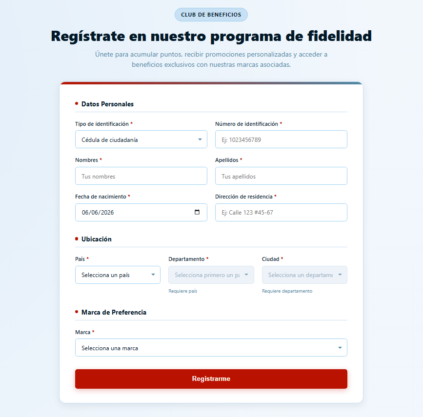

# 🎟️ Programa de Fidelidad — Formulario de Inscripción

Formulario de inscripción al programa de fidelidad de las marcas del grupo (Americanino, American Eagle, Chevignon, Esprit, Naf Naf y Rifle). Los datos de ubicación (país → departamento → ciudad), tipo de identificación y marca se consultan dinámicamente desde la base de datos mediante una API REST.

   

## Vista previa



## 🧱 Arquitectura

```
React (Vite)  ──Axios──▶  Flask API (REST)  ──SQLAlchemy──▶  SQLite
localhost:5173             localhost:4000
```

| Capa | Tecnología |
|---|---|
| Frontend | React 19 + Vite |
| Backend | Python + Flask + Flask-CORS |
| ORM / Base de datos | SQLAlchemy + SQLite3 |
| Comunicación | Axios (REST) |

## 🗃️ Modelo de datos

| Tabla | Descripción |
|---|---|
| `pais` | Catálogo de países |
| `departamento` | Catálogo de departamentos (FK → `pais`) |
| `ciudad` | Catálogo de ciudades (FK → `departamento`) |
| `tipo_identificacion` | CC, CE, TI, Pasaporte |
| `marca` | Marcas del grupo |
| `inscripcion` | Registro del cliente (FK → `tipo_identificacion`, `ciudad`, `marca`) |

`pais` → `departamento` → `ciudad` están encadenados por llave foránea, por eso en el formulario los combos funcionan en cascada (el país filtra los departamentos, el departamento filtra las ciudades).

## 🔌 Endpoints de la API

| Método | Endpoint | Descripción |
|---|---|---|
| `GET` | `/api/tipos-identificacion` | Lista los tipos de identificación |
| `GET` | `/api/marcas` | Lista las marcas del grupo |
| `GET` | `/api/paises` | Lista los países |
| `GET` | `/api/departamentos?pais_id=` | Departamentos de un país |
| `GET` | `/api/ciudades?departamento_id=` | Ciudades de un departamento |
| `GET` | `/api/inscripciones` | Lista todas las inscripciones registradas |
| `POST` | `/api/inscripciones` | Crea una nueva inscripción |

## ⚙️ Guía de ejecución (para el evaluador)

> Requisitos previos: **Python 3.10+** y **Node.js 18+** instalados.

### 1. Backend (Flask)

```bash
cd Backend
python -m venv venv
```

Activa el entorno virtual según tu terminal:

| Terminal | Comando |
|---|---|
| CMD (Windows) | `venv\Scripts\activate.bat` |
| PowerShell (Windows) | `venv\Scripts\Activate.ps1` |
| Git Bash | `source venv/Scripts/activate` |
| macOS / Linux | `source venv/bin/activate` |

> ⚠️ Si PowerShell da un error de "no se puede cargar el script porque la ejecución de scripts está deshabilitada", corre esto una sola vez y vuelve a intentar: `Set-ExecutionPolicy -Scope Process -ExecutionPolicy Bypass`

```bash
pip install -r requirements.txt
python seed.py                # crea y llena la base de datos (solo la primera vez)
python app.py                 # levanta la API en http://localhost:4000
```

La base de datos (`database/fidelidad.db`) se crea automáticamente al correr `seed.py`, no requiere ninguna configuración adicional.

> El entorno virtual es opcional para que el proyecto funcione (puedes instalar directo con `pip install -r requirements.txt` sin activar nada), pero se recomienda para no mezclar estas dependencias con otros proyectos de Python en tu máquina.

### 2. Frontend (React + Vite)

En otra terminal:

```bash
cd Frontend
npm install
npm run dev                   # levanta la app en http://localhost:5173
```

### 3. Probar

Con **ambos servidores corriendo**, abre `http://localhost:5173`, llena el formulario y da clic en **Registrarme**. Puedes verificar el registro consultando `http://localhost:4000/api/inscripciones` desde el navegador.

> ⚠️ Backend y frontend deben ejecutarse al mismo tiempo, en terminales separadas, para que la aplicación funcione.

## ✅ Cumplimiento del requerimiento

- [x] Formulario con tipo de identificación, número de identificación, nombres, apellidos, fecha de nacimiento, dirección, ciudad, departamento, país y marca.
- [x] Tipo de identificación, ciudad, departamento, país y marca son listas desplegables consultadas desde la base de datos.
- [x] Los datos ingresados quedan almacenados en el modelo de base de datos (`inscripcion`).

## 📂 Estructura del repositorio

```
Prueba_Tecnica/
├── Backend/
│   ├── app.py            # Endpoints de la API
│   ├── models.py         # Modelos SQLAlchemy
│   ├── seed.py            # Script de poblado de catálogos
│   └── requirements.txt
└── Frontend/
    └── src/
        ├── components/InscripcionForm/
        └── services/       # Instancias de axios y llamadas a la API
```
